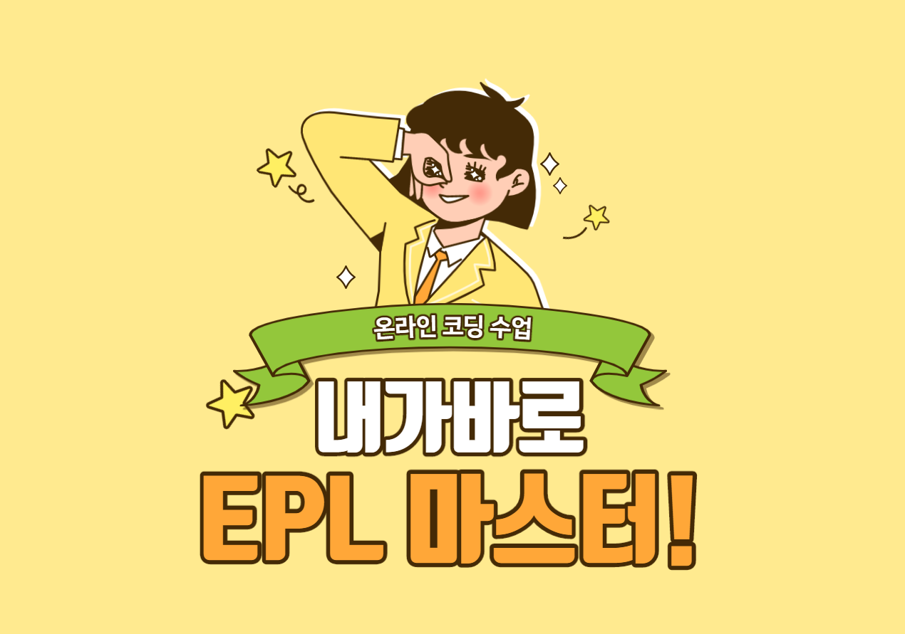
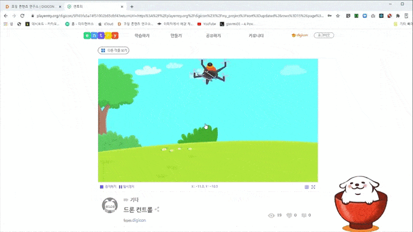

# 🥇 내가바로 E.P.L Master 🥇

## ◆  E.P.L 이란?

Education Programming Language의 약자로 블럭을 사용하여 프로그래밍을 진행하는 교육용 컴퓨팅 언어 프로그램을 의미 합니다.  
대표적인 프로그램으로 스크래치, 엔트리, mBlock 등이 있습니다.

## ◆  ****프로그램은 어떻게 진행 되나요?

각 블럭 프로그램을 선택하고 단계별로 학습할 수 있는 섹션들을 제공합니다.  
각 센션별 학습 프로그램을 마치고 난 후 온라인 Challenge를 통해   
내가 만든 결과물을 공유하게 됩니다.   
\(물론  시상과 상품도 있습니다  😆 \)  
  
나의 필요에 맞는 프로그램을 선택하여 학습하고 마지막 challenge 까지 **도전해 보세요!**  

## ◆  차별 프로그램 



##  🎮 드론게임 만들기

* **1차시: 코딩 블럭 살펴보기  :** 엔트리에 사용되는 ****기본 동작 블럭 살펴보기 
* **2차시: 내가 바로 드론 마스터! - 1** : 키보드 입력 블럭을 사용하여 드론 오브젝트 이동하기! 
* **3차시: 내가 바로 드론 마스터! - 2** :  오브젝트 복사하기 블럭을 사용하여 게임 완성하기! 
* **4차시: 내가 바로 드론 마스터! - 3** : 신호 보내기 블럭을 사용하여 백신을 전달하는 게임 완성하기!  



 

## ◆  수업 참여  Tip !

스마트폰과 컴퓨터 브라우저 화면을 함께 사용해 보세요!  
  
스마트폰으론 학습 내용과 실습 영상을!  
컴퓨터 브라우저에선 학습 내용과 함께 코딩 실습 진행해 보세요!  
\(모든 실습은 잊지 말고 크롬 브라우저에서 진행해 주세요! 😊\)  

