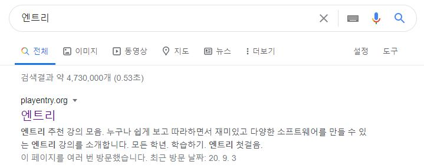
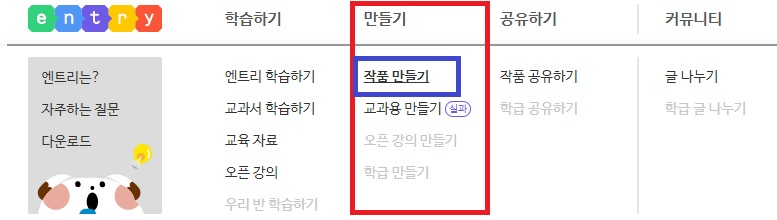
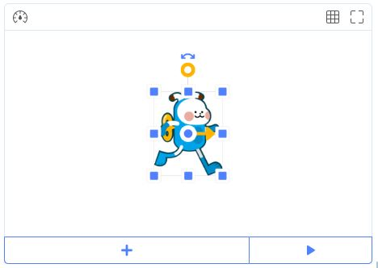
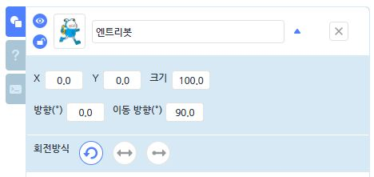
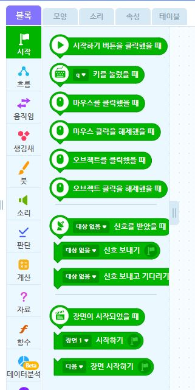
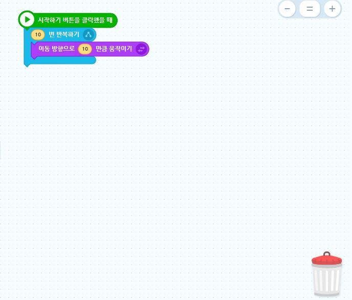

# 1차시

> 블럭코딩이란 무엇일까요? 블럭코딩 프로그램을 배워본 경험이 있나요?  
> 레고처럼 블럭을 사용하여 간단하게 프로그래밍을 배울 수 있는 교육적 프로그램인  
> E.P.L \(Education Programming Language\)은  
> 코딩을 처음 배우는 입문자에게 적합한 교육 프로그램 입니다!
>
> 이번 1차시에선 블럭코딩 프로그램인 엔트리를 사용하는 방법과 기본 블럭들에 대해  
> 간단히 살펴보는 시간을 가져보겠습니다! 😊





## 🔶 step by step! ✍

영상 잘 보았나요? 😎  
혹시 너무 재미있어서 내용을 놓친 친구들을 위해 한 번 더 복습해 봅시다!



## 

### 1. 검색창에 '엔트리'를 검색하여 홈페이지로 이동합니

## 

### **2.만들기 메뉴 또는 작품 만들기를 클릭하여 블럭코딩 화면으로 이동합니다**




### 3. 블럭코딩 에디터 창을 살펴 봅시

#### - 블럭코딩 결과를 확인할 수 있는 실행 창

#### 

#### - 블럭코딩에 사용되는 오브젝트들을 볼 수 있는 

#### - 다양한 명령 블럭들이 있는 블럭 메뉴 

#### - 블럭들을 사용하여 코딩 할 수 있는 편집 창 




짧은 시간이었지만 엔트리가 어떻게 구성되어 있는지  
아시겠죠? 😊  
  
이제 2차시 부터 직접 블럭들을 사용하여 게임을 완성해 보려 합니다! 😎  
2차시를 클릭해 이동하여 학습 개요와 실습을 진행해 보세요!

