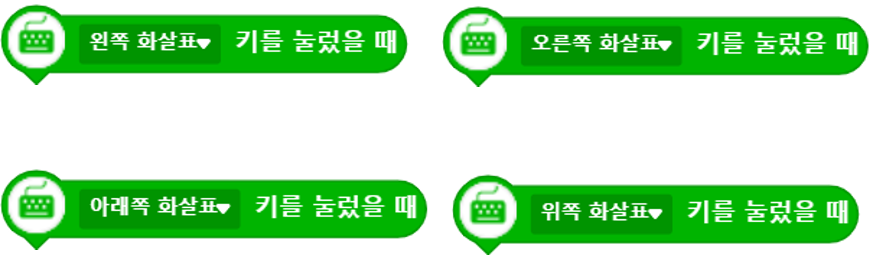
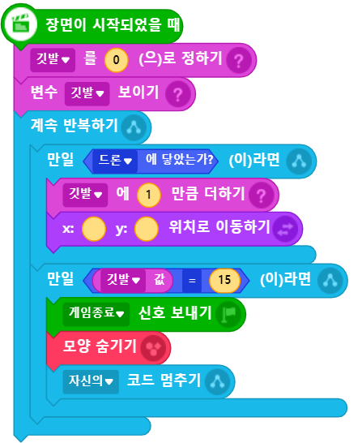

# 2차시

## ◇  드론을 움직이려면 어떻게 해야 할까요?

엔트리 사이트로 이동하여 어떤 프로젝트인지 먼저 살펴 봅시다. 😀

{% embed url="https://playentry.org/digicon/5f165fa5a74f51002b85dbf4?returnUrl=https%3A%2F%2Fplayentry.org%2Fdigicon%23!%2Fmy\_project%3Fsort%3Dupdated%26rows%3D15%26page%3D1%26tab%3Dmy\_project%26type%3Dproject\#!/" %}

\(⏏ 위 링크 블럭을 클릭하여 이동해 주세요! ⏏\)  

## ◇ 주요 블럭 살펴보기











