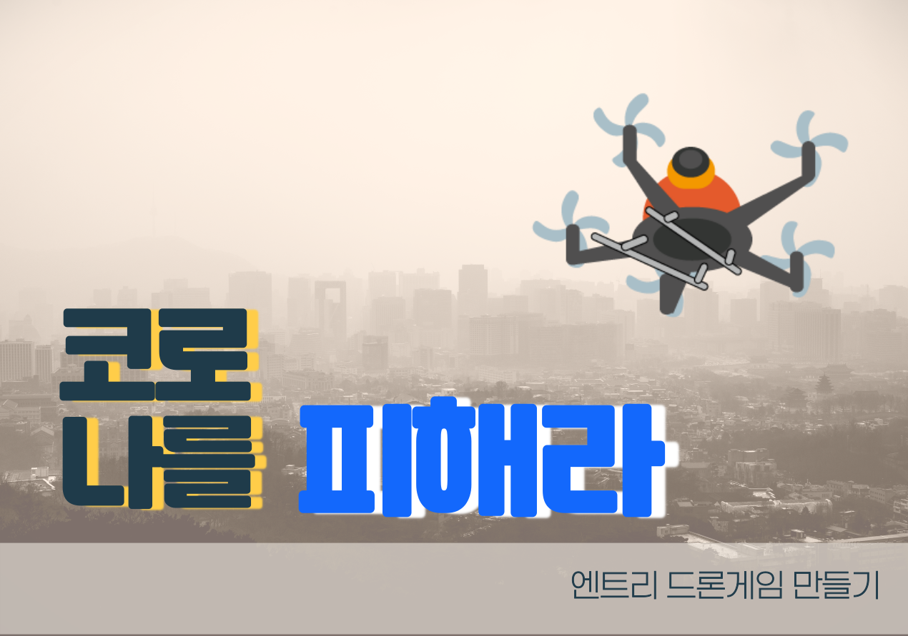

# Entry

## 🚩  수업차시 설명

> 드론을 조정하여  코로나 바이러스를 피해 무사히 백신을 시민들에게 전달하기 위한   
> 스토리를 담은 총 4차시의 수업을 진행합니다.  
>   
> **1차시**는 엔트리의 기본 블럭들을 살펴봅니다.  
> **2차시**는 드론을 조정하기 위한 명령블럭들을 배워봅니다.  
> **3차시**는 코로나 바이러스가 복제되어 도시를 오염 시키는 애니메이션을 만들어 봅니다.  
>   
> 마지막 **4차시**는 드론을 조정하여 백신을 전달하는 게임을 만들어 봅니다.

  









